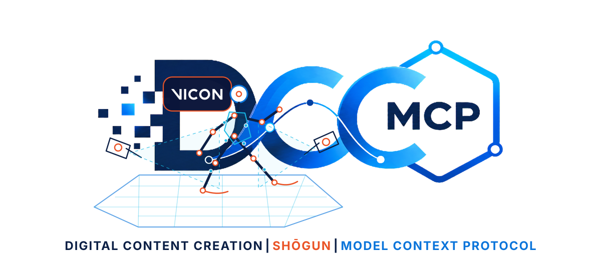
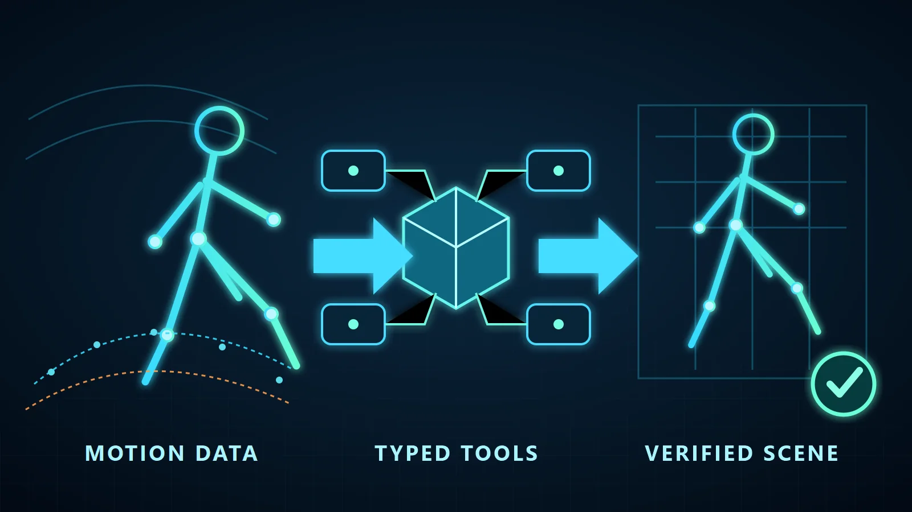

# dcc-mcp-shogun



[](https://github.com/dcc-mcp/dcc-mcp-shogun/actions/workflows/ci.yml)
[](https://pypi.org/project/dcc-mcp-shogun/)
[](https://pypi.org/project/dcc-mcp-shogun/)

A typed, local-first DCC-MCP adapter for Vicon Shogun Post motion-capture
inspection, timeline control, bounded cleanup, processing, and file workflows.



The adapter uses Vicon's official local `ViconShogunPost` control-stream SDK and
its `Scene`, `Timeline`, `Offline`, `Channel`, `FIRFilter`, and
`WeightedAverageFilter` contracts. It does not expose arbitrary Python or HSL
execution. One operator-allowlisted, fixed-signature HSL pipeline bridge covers
host-installed production commands that have no official `Offline` equivalent.
Application controls not exposed by the SDK remain an explicit, exact-window
DCC UI Control fallback.

Shogun Post ships an external Python SDK. The adapter runs in its own Python
process and connects to the application's local control stream; it does not rely
on a general-purpose Python interpreter embedded in the Shogun Post UI.

## Installation

Install the released wheel, then verify the exact Shogun Post process before
starting the adapter:

```powershell
python -m pip install "dcc-mcp-shogun==0.10.0" # x-release-please-version
$env:DCC_MCP_SHOGUN_HOST_PID = "<SHOGUN_POST_PID>"
dcc-mcp-shogun doctor --json
dcc-mcp-shogun verify --json
```

Continue only when `directly_usable` is `true`. See the complete
[Install SOP](install.md) for the agent quick path, supported platforms and
versions, upgrade, uninstall, stable exit codes, and troubleshooting.

## Capabilities

- inspect path-redacted scene metadata and bounded subject lists;
- inspect subject markers, skeleton hierarchy, constraints, and static subject
  parameters;
- query one marker trajectory value or an inclusive window of at most 2,000
  frames;
- inspect the capability-gated Scene object graph, hierarchy, transforms,
  attribute/channel names, bounded channel samples and gaps, expression-safe
  labeling/solving setup parameters, rigid-body transforms and attached markers,
  optical/video-camera calibration and presentation summaries, selection,
  visibility, selectability, and opacity;
- inspect and explicitly change current frame, selected time ranges,
  range selection derived from keys, play/animation ranges, and playback through
  the capability-gated `Timeline` interface;
- inspect bounded Clip timing, offsets, time scale, lock and SMPTE alignment;
  read or explicitly change the active Clip; and update an allowlisted Clip
  timing subset with vendor read-back verification and rollback;
- inspect Character frame bounds and shot-QA flags, and update only six
  allowlisted Boolean workflow fields with vendor read-back verification and
  rollback, while excluding artist identities and free-form notes;
- repair one explicit marker sample with read-back verification; select channel
  keys from the current ranges, delete one explicit key or selected keys, and
  apply bounded FIR or weighted-average filtering that defaults to selected keys;
- inspect a stable allowlist of processing settings and invoke reconstruct,
  ROM labeling, subject calibration, auto-label, occlusion fixing, solve,
  QuickPost, or retarget through the official `Offline` interface; reconstruction,
  occlusion, and solving setting updates are allowlisted and rollback-aware;
- invoke one exact host-installed HSL pipeline command from an operator-owned
  allowlist with only bounded load, mode, export, gap-fill, filter, and labeling
  parameters; no command is enabled by default and no HSL source is accepted;
- expose capability-gated import, save, and export calls that map directly to
  the official SDK;
- register one Shogun Post GUI instance with the DCC-MCP local gateway.

The mutating surface is deliberately narrow. Clip mutation cannot create,
remove, rename, or reparent NLE objects, and Character mutation cannot read or
write artist identities or free-form notes. Both mutation paths validate every
field before connecting, verify the vendor read-back, and attempt rollback on
partial failure. Cleanup never exposes the SDK's
unbounded `DeleteAllKeys` operation. Single-sample writes are finite and bounded,
return the previous value, and fail if Shogun does not return the requested
sample. Processing requires an explicit
`current_frame` or `selected_ranges` scope; the complete play range is not an
available implicit default. The adapter does not expose scene replacement,
arbitrary HSL/Python execution, unallowlisted pipeline commands, or bulk raw
trajectory writes. Existing outputs
fail closed unless `overwrite=true`, and public results omit full file-system
paths. The Scene surface does not expose object creation, removal, reparenting,
setup-parameter creation/expression edits, or raw attribute writes. Attribute
values, setup expression source, camera device identifiers, firmware, and
capture/video file paths are intentionally omitted from inspection results.

The subject, marker, skeleton, constraint, parameter, and trajectory queries in
`shogun-scene` are live-validated against Shogun Post 1.19. The newer official
`Scene` object model is live-validated for scene-object, rigid-body, and
video-camera inventories in an initialized 100-frame blank session. A fresh
zero-frame placeholder session rejects those same official object-list commands
with `ControlError`; the adapter reports that host-state boundary instead of
claiming an empty inventory. Individual object-detail operations remain
scene-state gated. A live 1.19 host also rejected the SDK's `ImportFile` call
with `ControlError`, without partially changing the scene. The separate
`shogun-files` Skill therefore remains explicitly host-build and
license-capability gated: its tools are typed and fail closed, but import,
save, and export are not claimed as live-supported on 1.19.

The setup-parameter, rigid-body, and video-camera extensions use the official
1.19 object types and are schema- and contract-tested. Wheel-installed and
public-PyPI adapters both registered all 27 Scene tools in live 1.19 hosts. The
three inventory calls completed in the initialized blank session; in a separate
zero-frame placeholder they returned only bounded `ControlError` results, and
follow-up typed inspection confirmed that the exact host remained available.
Successful parameter and detail reads from a disposable non-empty scene are not
yet claimed.

The same 1.19 host exposes the official `Timeline` and `Offline` Python classes
but rejects their commands as invalid for that host application. The
`shogun-timeline` and `shogun-processing` Skills therefore remain explicitly
capability-gated: their schemas and SDK mappings are tested, while 1.19 support
is not claimed. A rejection is returned as a bounded typed error and never
triggers UI automation.

`shogun-editing` is separately capability-gated. Its schemas and SDK mappings
are tested against the 1.19 SDK contract. All five tools were also loaded and
dispatched through a live 1.19 host: against an empty scene, each mutation was
safely rejected as a bounded `ControlError`, with the scene remaining empty.
Trajectory write and filter effects on a non-empty disposable take are not yet
claimed as live-validated. A host-build or scene-state rejection never falls
back to arbitrary script execution.

`shogun-production-context` exposes eight Clip and Character tools. Its four
read-only tools were loaded and dispatched through a live 1.19 host; the blank
scene returned bounded `ControlError` responses and the host remained
available. All eight current tools were then loaded from the packaged Skill in
a live 1.19 adapter; `get_active_clip` reached the official Scene interface and
returned the same bounded `ControlError` on the blank scene without affecting
host availability. The active-Clip, Clip-timing, and Character-QA mutation
contracts are SDK-mapped, schema-tested, read-back verified, rollback-aware,
and remain capability-gated until a disposable non-empty scene is available
for live mutation evidence. The official Database interface is intentionally
not public: an isolated read probe coincided with host termination, so it
remains deferred until that stability signal can be reproduced and resolved.

The implemented contracts follow Vicon's official
[Shogun Post documentation](https://vicon-help.atlassian.net/wiki/spaces/ShogunPost118/overview),
[Python scripting guide](https://vicon-help.atlassian.net/wiki/spaces/ShogunPost118/pages/544283341/Python%2Bscripting%2Bwith%2BVicon%2BShogun%2BPost),
and [HSL command reference](https://help.vicon.com/download/attachments/196380086/HSL%20scripting%20with%20Vicon%20Shogun.pdf).
See the maintained [official SDK coverage matrix](docs/official-sdk-coverage.md)
for implemented and intentionally deferred interface families.

## Showcase

The repository includes an original, deterministic 240-frame BVH motion source
and generator under [`examples/showcase`](examples/showcase). It is intended for
reproducible import experiments without redistributing production capture data.

See [`docs/showcase.md`](docs/showcase.md) for the full launch, discovery,
inspection, and evidence workflow.

## Local development

For repository development only, start Vicon Shogun Post with your normal
application launcher and use an editable install:

```powershell
python -m pip install -e ".[dev]"
dcc-mcp-shogun --host-pid <SHOGUN_POST_PID>
```

The adapter discovers the official SDK beside the selected host process. An
operator can instead set `DCC_MCP_SHOGUN_SDK_PATH` to the SDK's `Win64`
directory. The adapter resolves the selected host process's control-stream
listener; `DCC_MCP_SHOGUN_CONTROL_PORT` may override it only when that port is
owned by the same host process.

Shogun Post opens its control-stream listener late in startup. Vicon documents
803 as the default port; additional local instances search incrementally upward,
and operators can configure a fixed port. The adapter therefore waits for the
selected host process to open a listener in its bounded 803-899 discovery window
and confirms candidates with a real SDK handshake before serving. It never
binds or changes Shogun's port. For a fixed port outside that discovery window,
set `DCC_MCP_SHOGUN_CONTROL_PORT` explicitly. The wait defaults to 120 seconds
and can be tuned with `DCC_MCP_SHOGUN_CONTROL_PORT_TIMEOUT` (seconds).

The DCC-MCP listener uses an OS-assigned loopback port unless `--mcp-port` or
`DCC_MCP_SHOGUN_PORT` is explicitly set. Use `dcc-mcp-cli list`, `search`,
`describe`, and `call` rather than storing the resolved endpoint.

Custom production pipelines are disabled by default. To enable the fixed typed
pipeline bridge, set `DCC_MCP_SHOGUN_PIPELINE_ALLOWLIST` before starting the
adapter to a comma-separated list of exact host-installed HSL command
identifiers. The setting grants access only to those identifiers; it does not
accept HSL source, paths, or command fragments.

Use `dcc-mcp-shogun verify --pipeline-command <COMMAND> --json` to check one
identifier before a destructive call. The non-gating `pipeline_policy` receipt
reports only configuration validity, command count, restart requirements, and
the requested membership result; it never returns command names or environment
contents. Policy changes still require restarting the adapter.

## Validation

```powershell
python -m ruff check src tests tools
python -m ruff format --check src tests tools
python -m pytest
python tools/lint_skills.py
python -m build
```

## Privacy and safety

- Connections are limited to the local Shogun control stream.
- Tool results reduce file paths to base names.
- Errors report exception classes, not SDK install paths or machine details.
- Attribute inspection returns names only, and camera summaries omit device IDs.
- The scene Skill limits mutation to selection and display state; the file Skill
  exposes only bounded import/save/export operations; editing requires an
  explicit object/channel or subject/marker/frame; processing never defaults to
  the full play range; pipeline execution requires an operator-owned exact
  command allowlist and fixed typed arguments.
- Authentication, licensing, UAC, and security dialogs are never automated.

Vicon and Shogun are trademarks of Vicon Motion Systems Ltd. This independent
adapter is not affiliated with or endorsed by Vicon.

## License

MIT
